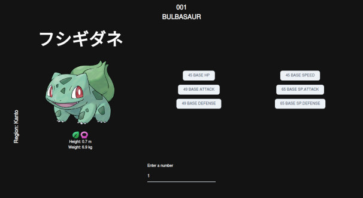

# Pokedex

[](https://app.netlify.com/sites/heuristic-brown-9dc575/deploys)


Simple search app that consumes [PokeAPi] and displays basic information about Pokemon created with React JS + Typescript 





### Tech

The stack I used: 

* [ReactJS] - A JavaScript library for building user interfaces 
* [Typescript] - Typed JavaScript at any scale
* [Tailwindcss] - A utility-first CSS framework for
rapidly building custom designs
* [Twin.Macro] - Use tailwind classes within jss-in-css libraries
* [Styled] - Use the best bits of ES6 and CSS to style your apps without stress


### Installation

Install the dependencies and start the server.

```sh
$ cd pokedex
$ yarn install
$ yarn build
```

## Available Scripts

In the project directory, you can run:

### `yarn start`

Runs the app in the development mode.<br />
Open [http://localhost:3000](http://localhost:3000) to view it in the browser.

The page will reload if you make edits.<br />
You will also see any lint errors in the console.

### `yarn test`

Launches the test runner in the interactive watch mode.<br />
See the section about [running tests](https://facebook.github.io/create-react-app/docs/running-tests) for more information.

### `yarn build`

Builds the app for production to the `build` folder.<br />
It correctly bundles React in production mode and optimizes the build for the best performance.

The build is minified and the filenames include the hashes.<br />
Your app is ready to be deployed!

See the section about [deployment](https://facebook.github.io/create-react-app/docs/deployment) for more information.


### Todos

 - Write tests
 - Add pagination
 - Refactor components
 - Add addaptive background feature
 

### Features

- Type in the pokemon number and you will get some basic information about the pokemom

## Status
Project is: _in progress_

## Inspiration
Project inspired by Mauro E. Wernly design on dribbble<br>[Shoot]


Deployed with [](https://www.netlify.com/)

[//]: # (These are reference links used in the body of this note and get stripped out when the markdown processor does its job. There is no need to format nicely because it shouldn't be seen. Thanks SO - http://stackoverflow.com/questions/4823468/store-comments-in-markdown-syntax)


   [ReactJS]: <https://reactjs.org/>
   [Typescript]: <https://www.typescriptlang.org/>
   [Tailwindcss]: <https://tailwindcss.com/>
   [Twin.Macro]: <https://github.com/ben-rogerson/twin.macro>
   [Styled]: <https://styled-components.com/>
   [PokeAPi]: <https://pokeapi.co/>
   [Shoot]: <https://dribbble.com/shots/6175056-Pok-dex>